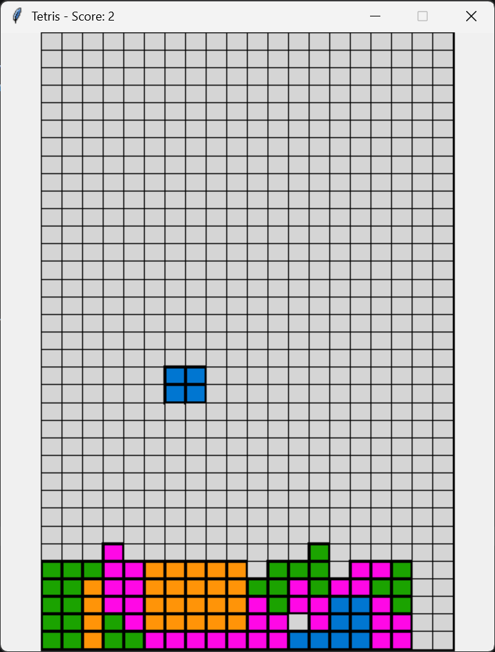

# 🎮 Tetris in Python

A playable implementation of the classic Tetris game developed in Python using Tkinter.

This project was created as a final project for Stanford University's Code in Place 2026 program and demonstrates fundamental computer science concepts including event-driven programming, game loops, collision detection, state management, and graphical rendering.

---

## Features

- Random tetromino generation
- Piece movement
- Piece rotation
- Collision detection
- Automatic piece falling
- Line clearing
- Score tracking
- Pause functionality
- Sound effects
- Game Over detection
- Modular architecture

---

## Technologies Used

- Python 3
- Tkinter
- NumPy
- playsound

---

## Controls

| Key | Action |
|-------|----------|
| Left Arrow | Move piece left |
| Right Arrow | Move piece right |
| Up Arrow | Rotate counterclockwise |
| Down Arrow | Rotate clockwise |
| Space | Pause / Resume |
| P | Increase game speed (debug) |
| M | Decrease game speed (debug) |

---

## Project Structure

```text
Tetris/
│
├── main.py
├── game.py
├── board.py
├── renderer.py
├── shapes.py
├── constants.py
│
├── assets/
│   └── sounds/
│
└── README.md
```

### Module Responsibilities

| Module | Description |
|----------|-------------|
| main.py | Application entry point |
| game.py | Core game logic |
| board.py | Board management and line detection |
| renderer.py | Rendering using Tkinter Canvas |
| shapes.py | Tetromino definitions |
| constants.py | Game configuration values |

---

## Installation

Clone the repository:

```bash
git clone https://github.com/YOUR_USERNAME/py-tetris.git
cd py-tetris
```

Install dependencies:

```bash
pip install numpy playsound
```

Run:

```bash
python main.py
```

---

## Screenshot





---

## Learning Objectives

This project was developed to practice:

- Python programming
- Modular software design
- Event-driven applications
- Collision detection algorithms
- Matrix manipulation
- GUI development with Tkinter
- Game state management

---

## Future Improvements

- Level progression
- Next piece preview
- High score persistence
- Improved user interface
- Additional sound effects
- Better rotation handling near walls

---

## Author

Daniel P.

Created as part of Stanford Code in Place 2026.

---

## License

MIT License